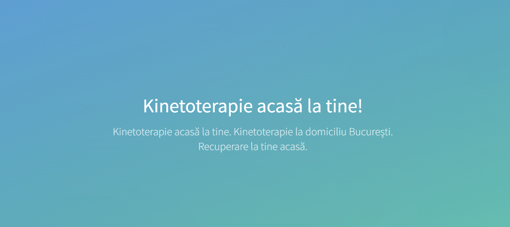

## Physio Home

### Physio Home - Recovery with Physiotherapy at Home

"Physio Home" is a project I developed using the Hugo framework. This site offers information and resources for home-based physical therapy, bringing essential services to users' homes. The responsive design and advanced features allow visitors to easily access the necessary information, contact professionals, and benefit from therapy services tailored to their needs.

## Technology Stack

#### Static Site Generation:
- Hugo Framework: A fast static site generator for building and deploying the site.

#### Frontend:
- Bootstrap: For responsive and mobile-friendly design.

#### CDN:
- Cloudflare: To ensure fast delivery and enhanced security.

#### Miscellaneous:
- PWA (Progressive Web App): For offline capabilities and an improved user experience.
- Open Graph: For better social media sharing.
- HTTP/3: For faster and more secure connections.

#### Maps:
- Leaflet 1.4.0: For interactive maps.

#### JavaScript Libraries:
- Modernizr 2.6.2: For feature detection.

[See the project](https://kineto-acasa.ro/)
