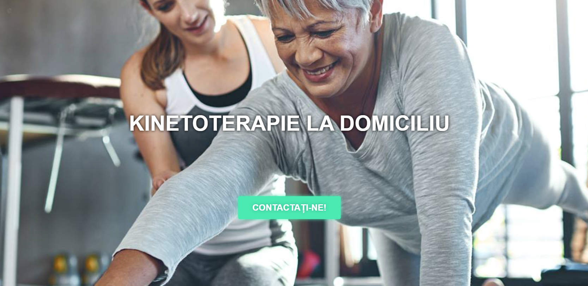

## Kinetoladomi

### Kinetoladomi - Recovery with Physiotherapy

Kinetoladomi is a website dedicated to promoting physical therapy and rehabilitation services. It serves as a platform to showcase the benefits of kinesiology and provides information about at-home therapy services, client programs, and expert guidance. The site aims to connect clients with professional therapists, offering convenience and personalized care.

### Technologies Used:

#### CMS and Blogging Platform:

- WordPress 6.7.1 for content management and blogging.

#### Frontend Enhancements:

- Elementor 3.25.10 for building and customizing pages.
- ElementsKit for additional widgets and features for the page builder.
- Swiper for elegant and responsive sliders.
- LazySizes for lazy loading, optimizing page speed.

#### CDN and Performance Optimization:

- jsDelivr as the CDN for fast resource delivery.
- Autoptimize 3.1.12 for script and style optimization.

#### SEO and Marketing Tools:

- Yoast SEO for improved search engine optimization.

#### Miscellaneous Features:

- Google Maps for location-based services.
- Tawk.to for live chat and customer support.
- Open Graph for enhanced social media sharing.

[See the project](https://kinetoladomi.ro/)
