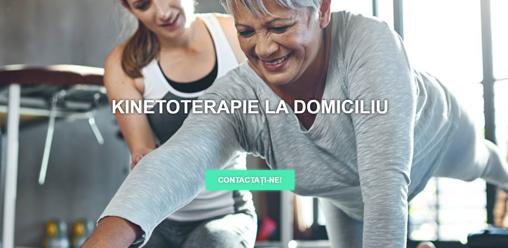

## Kinetoladomi

### Kinetoladomi - Recuperare prin Kinetoterapie

Kinetoladomi este un site dedicat promovarii serviciilor de kinetoterapie si reabilitare. Acesta servește ca o platformă pentru a prezenta beneficiile kineziologiei și oferă informații despre serviciile de terapie la domiciliu, programele clienților și îndrumarea experților. Site-ul își propune să pună în legătură clienții cu terapeuți profesioniști, oferind confort și îngrijire personalizată.

### Tehnologii Utilizate:

#### Platformă CMS și Blogging:

- WordPress 6.7.1 pentru gestionarea conținutului și blogging.

#### Îmbunătățiri Frontend:

- Elementor 3.25.10 pentru construirea și personalizarea paginilor.
- ElementsKit pentru widget-uri și funcționalități suplimentare pentru page builder.
- Swiper pentru slider-e elegante și responsive.
- LazySizes pentru încărcare întârziată, optimizând viteza paginilor.

#### Optimizare CDN și Performanță:

- jsDelivr ca CDN pentru livrarea rapidă a resurselor.
- Autoptimize 3.1.12 pentru optimizarea scripturilor și stilurilor.

#### Instrumente SEO și Marketing:

- Yoast SEO pentru îmbunătățirea optimizării pentru motoarele de căutare.

#### Funcționalități Diverse:

- Google Maps pentru servicii bazate pe locație.
- Tawk.to pentru chat live și suport pentru clienți.
- Open Graph pentru o partajare îmbunătățită pe rețelele sociale.

[Vezi Proiectul](https://kinetoladomi.ro/)
