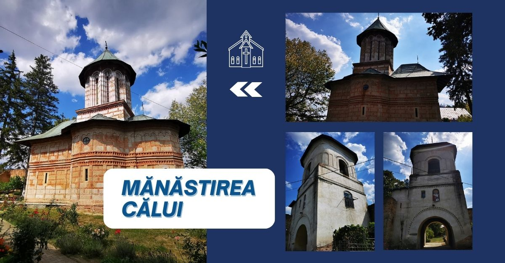

## Mănăstirea Calui

### Proiect European

„Mănăstirea Calui” este un proiect captivant pe care l-am dezvoltat folosind framework-ul Hugo. Acest proiect prezintă frumusețea fascinantă a unui loc numit „Mănăstirea Calui”. Prin design-ul vizual uimitor și conținutul captivant, vizitatorii pot explora istoria bogată, minunile arhitecturale și atmosfera senină a acestei mănăstiri magnifice. De la peisajele sale pitorești până la semnificația spirituală, proiectul „Mănăstirea Calui” surprinde esența acestei destinații încântătoare, invitând utilizatorii să pornească într-o călătorie virtuală ca nimeni altul.

### Tehnologii Utilizate

#### Generare Site Static:
- Hugo Framework: Un generator rapid de site-uri statice pentru crearea și lansarea site-ului.

#### Frontend:
- Bootstrap: Pentru un design responsive și prietenos cu dispozitivele mobile.

#### CDN:
- Cloudflare: Pentru livrarea rapidă a resurselor și o securitate sporită.

#### Diverse:
- PWA (Progressive Web App): Pentru funcționalități offline și o experiență îmbunătățită a utilizatorului.
- Open Graph: Pentru o partajare îmbunătățită pe rețelele sociale.
- HTTP/3: Pentru conexiuni mai rapide și mai sigure.

[Vezi Proiectul](https://www.manastirea-calui.ro/)