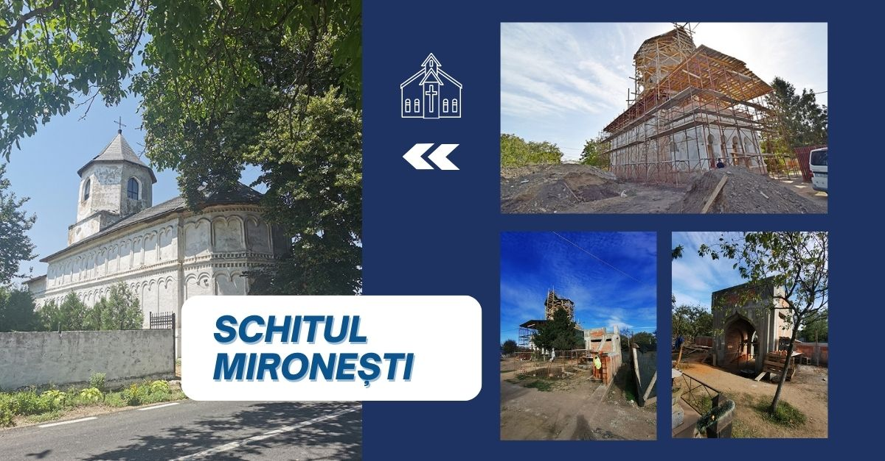

## Mironești Hermitage

### Mironești Hermitage European Project

"Schitul Mironești" is a captivating project I developed using the Hugo framework. This project showcases the mesmerizing beauty of a place called "Schitul Mironești." Through visually stunning designs and immersive content, visitors can explore the rich history, architectural marvels, and serene ambiance of this magnificent monastery. From its picturesque landscapes to its spiritual significance, "Schitul Mironești" project captures the essence of this enchanting destination, inviting users to embark on a virtual journey like no other.

### Technology Stack

#### Static Site Generation:
- Hugo Framework: A fast static site generator for building and deploying the site.

#### Frontend:
- Bootstrap: For responsive and mobile-friendly design.

#### CDN:
- Cloudflare: To ensure fast delivery and enhanced security.

#### Miscellaneous:
- PWA (Progressive Web App): For offline capabilities and enhanced user experience.
- Open Graph: For improved social media sharing.
- HTTP/3: For faster and more secure web connections.

[See the project](https://www.schitul-mironesti.ro/)
